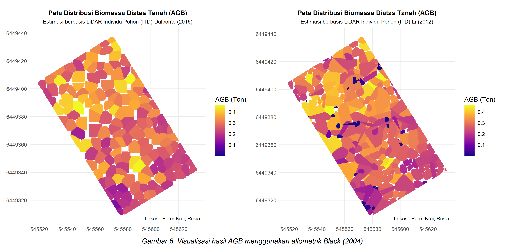
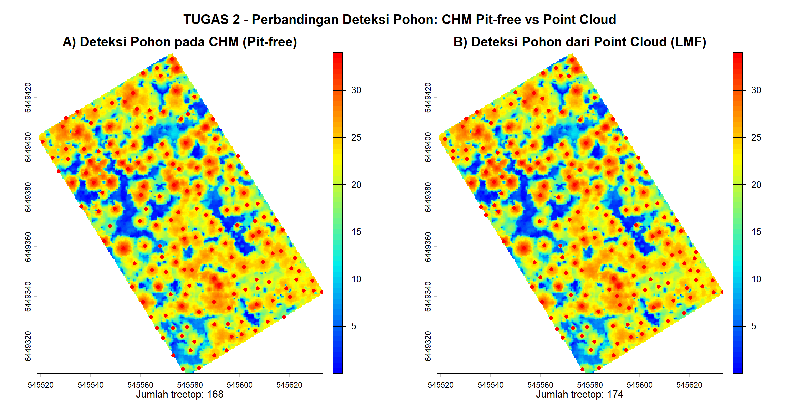

# LiDAR Tree Detection and AGB Analysis in R

## Project Overview
This project presents a LiDAR-based workflow in R for individual tree detection, crown segmentation, structural metrics extraction, and above-ground biomass (AGB) estimation.

The analysis demonstrates how point cloud data can be transformed into practical outputs for forestry analysis, vegetation assessment, and spatial decision support.

## Key Features
- Individual tree detection from LiDAR point cloud data
- Crown segmentation using established algorithms
- Extraction of structural forest metrics
- Above-ground biomass (AGB) estimation
- Visualization of LiDAR-derived outputs

## Methods
This project applies:
- Dalponte (2016) crown segmentation approach
- Li (2012) tree detection and segmentation workflow
- Black (2004) allometric equation for AGB estimation

## Tools and Libraries
- R
- LiDAR data processing workflow
- Spatial analysis and visualization tools

## Skills Demonstrated
- LiDAR point cloud analysis
- Individual tree detection
- Crown delineation and segmentation
- Forest structural metrics extraction
- Above-ground biomass estimation
- Geospatial visualization and interpretation

## Output Visualizations

<table>
  <tr>
    <td align="center"><b>AGB Visualization</b></td>
    <td align="center"><b>Pit-Free vs Point Cloud Comparison</b></td>
  </tr>
  <tr>
    <td></td>
    <td></td>
  </tr>
</table>

## Main Script
- `miniproject LIDAR.R`

## Data File
- `plot_06.las`

## Project Value
This repository demonstrates my capability to perform LiDAR-based geospatial analysis in R for forestry, biomass estimation, and vegetation structure assessment.

## Services I Can Offer
- LiDAR-based vegetation and forest analysis
- Tree detection and crown segmentation
- Biomass estimation and structural metrics extraction
- Spatial data analysis and geospatial visualization
- Research and technical reporting support

## Availability
I am open to freelance, research, and project-based opportunities related to LiDAR, GIS, remote sensing, and spatial analysis.

## Author
Dedy Lesmana
